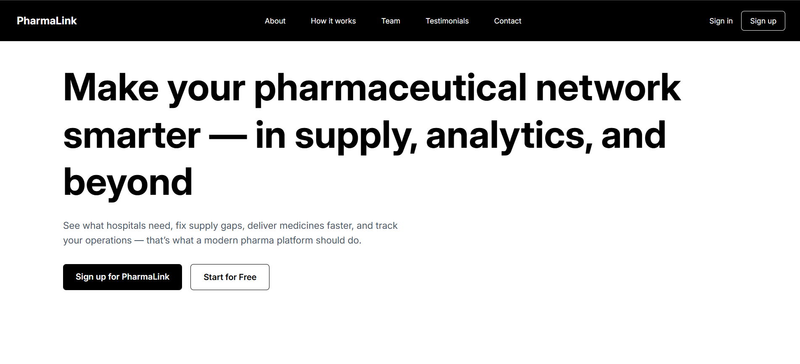
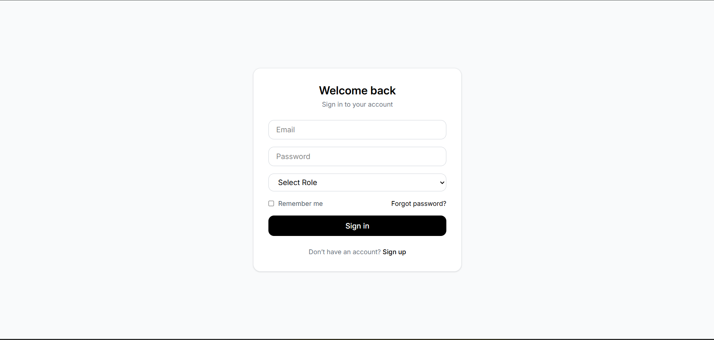
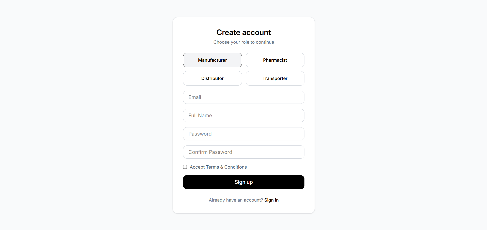
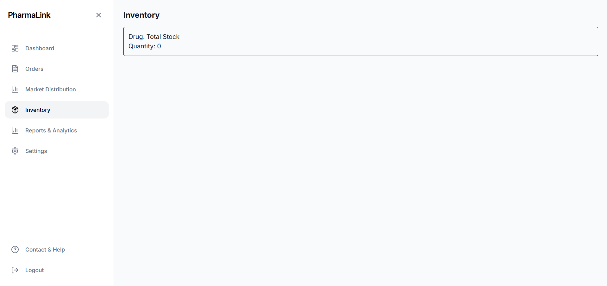
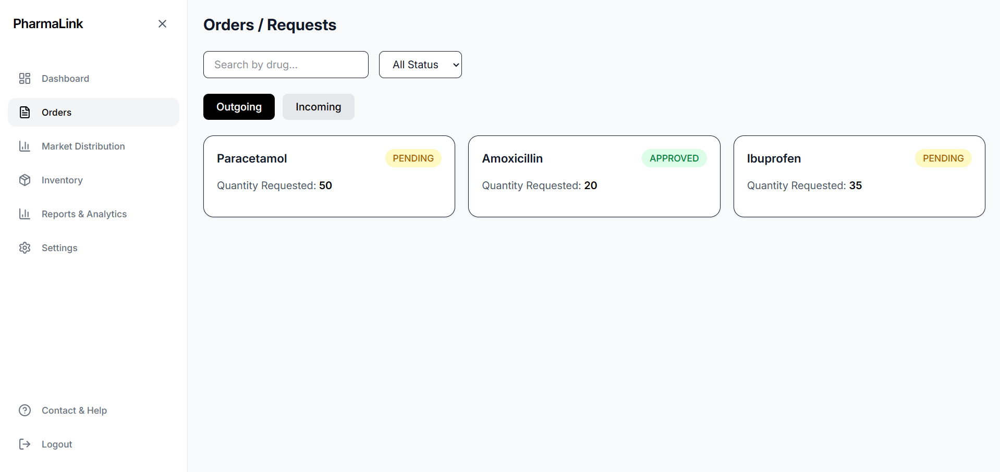
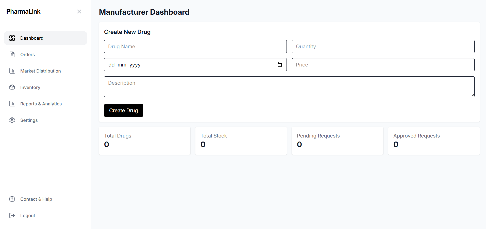
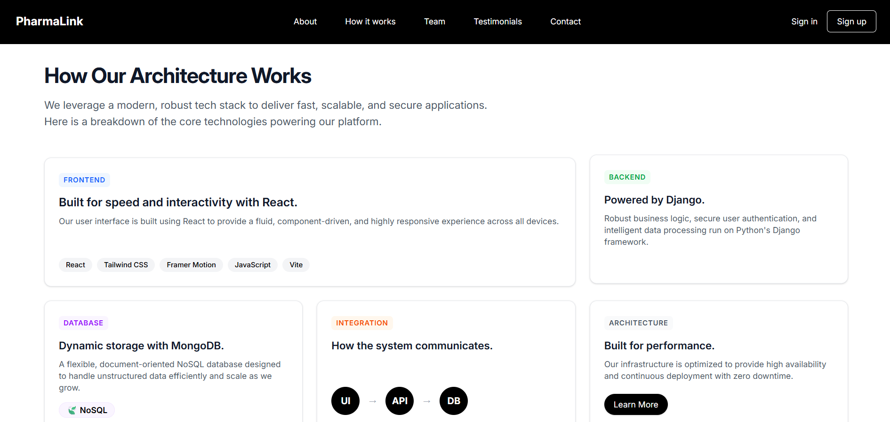
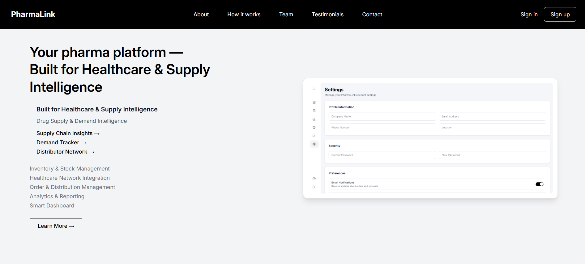
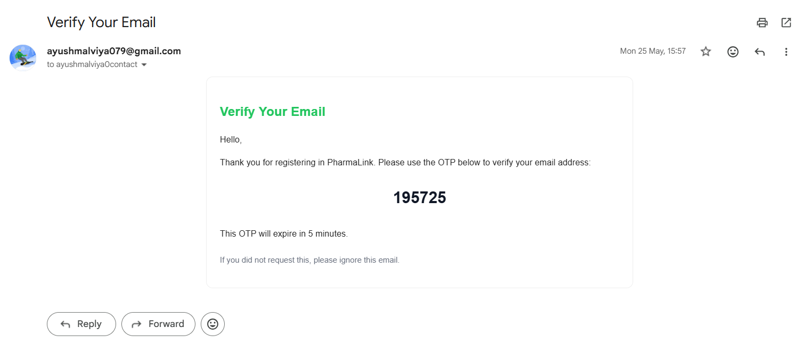

<div align="center">

# 💊 PharmaLink
### Intelligent Drug Inventory & Supply Chain Management Platform

A modern, scalable pharmaceutical inventory and supply chain management platform that enables manufacturers, distributors, transporters, and pharmacies to manage medicine inventory, monitor stock movement, and ensure complete supply chain transparency.


</div>

---

# 📖 Overview

PharmaLink is a role-based pharmaceutical supply chain management platform designed to digitize medicine inventory operations across the healthcare ecosystem.

The system enables manufacturers, distributors, transporters, and pharmacies to collaboratively manage medicine stock, track product movement, monitor inventory health, and receive automated alerts for low stock and upcoming expiries.

The platform emphasizes transparency, traceability, and operational efficiency throughout the drug supply chain.


---

# 🚀 Key Features

### 📦 Inventory Management

- Create and manage medicine inventory
- Batch-wise inventory tracking
- Manufacturing & expiry date management
- Real-time stock updates
- Category-based organization

---

### 🚚 Supply Chain Tracking

- Manufacturer → Distributor → Pharmacy workflow
- Shipment status monitoring
- Product movement history
- Order lifecycle tracking
- Delivery confirmation

---

### 👥 Role-Based Access Control

Different dashboards for:

- Manufacturer
- Distributor
- Pharmacist
- Transporter
- Administrator

Each user only accesses resources permitted by their role.

---

### 📊 Analytics Dashboard

- Total Medicines
- Low Stock Medicines
- Expired Medicines
- Near Expiry Products
- Monthly Inventory Trends
- Stock Distribution

---

### 🔔 Smart Alerts

- Low inventory notifications
- Expiry reminders
- Order updates
- Supply chain status notifications

---

### 🔐 Authentication & Security

- JWT Authentication
- Refresh Tokens
- Protected APIs
- Password Hashing
- Role-based Authorization
- Secure API Access

---

# 🛠 Tech Stack

## Frontend

- React
- Vite
- Tailwind CSS
- Axios
- React Router

---

## Backend

- Django
- Django REST Framework
- JWT Authentication
- Django ORM

---

## Database

- PostgreSQL


---

# 📂 Project Structure

```
PharmaLink/
│
├── frontend/
│   ├── src/
│   ├── components/
│   ├── pages/
│   ├── services/
│   └── assets/
│
├── backend/
│   ├── account/
│   ├── inventory/
│   ├── supplychain/
│   ├── dashboard/
│   ├── notifications/
│   └── config/
│
├── docs/
├── screenshots/
└── README.md
```

---
# 📸 Screenshots
## 📊 Dashboard

<p align="center">
  
</p>

## 🔐 Login Page

<p align="center">
  
</p>

---

## 📝 Registration

<p align="center">
  
</p>

---


---

## 💊 Inventory Management

<p align="center">
  
</p>

---

## 🚚 Distribution Management

<p align="center">
  
</p>

---

## 📦 Orders

<p align="center">
  
</p>

---

## 🏭 Manufacturer Dashboard

<p align="center">
  
</p>

---


## 🏗️ System Architecture

<p align="center">
  
</p>


---

## ℹ️ About Page

<p align="center">
  
</p>

---

## 🔑 OTP Verification

<p align="center">
  
</p>

---

## 📈 Report & Analysis

<p align="center">
  
</p>
---

# ⚡ Installation

## Clone Repository

```bash
git clone https://github.com/yourusername/pharmalink.git
cd pharmalink
```

---

## Backend Setup

```bash
cd backend

python -m venv venv

source venv/bin/activate

pip install -r requirements.txt

python manage.py migrate

python manage.py runserver
```

---

## Frontend Setup

```bash
cd frontend

npm install

npm run dev
```

---

# 🔑 Environment Variables

Create a `.env` file inside the backend.

```env
SECRET_KEY=

DEBUG=True

DATABASE_URL=

EMAIL_HOST=

JWT_SECRET=

SUPABASE_URL=

SUPABASE_KEY=
```

---

# 📡 REST API

## Authentication

```
POST /api/register/

POST /api/login/

POST /api/token/refresh/
```

---

## Inventory

```
GET    /api/inventory/

POST   /api/inventory/

PUT    /api/inventory/{id}

DELETE /api/inventory/{id}
```

---

## Dashboard

```
GET /api/dashboard/manufacturer/

GET /api/dashboard/distributor/

GET /api/dashboard/pharmacy/
```

---

# 🔒 Security Features

- JWT Authentication
- Refresh Token Rotation
- Password Encryption
- Role-Based Access Control
- Protected REST APIs
- CORS Configuration
- Input Validation

---

# 🎯 Future Improvements

- Barcode & QR Scanning
- AI Demand Forecasting
- Blockchain Drug Traceability
- IoT Temperature Monitoring
- Mobile Application
- SMS Notifications
- Email Alerts
- Multi-Warehouse Support

---

# 🤝 Contributing

Contributions are welcome!

1. Fork the repository
2. Create a new feature branch

```
git checkout -b feature/new-feature
```

3. Commit your changes

```
git commit -m "Add new feature"
```

4. Push your branch

```
git push origin feature/new-feature
```

5. Open a Pull Request

---

# 📄 License

This project is licensed under the MIT License.

---
# 🤝 Contributors

This project was collaboratively developed by:

| Name | Role |
|------|------|
| **Ayush Malviya** | Backend Development, API Design, Authentication, Database |
| **Ayukti Thakur** | Frontend Development, UI/UX |
| **Arpita Sharma** | Frontend Development, Components & Integration |
| **Anurag Vaishnav** | Testing, Documentation & Quality Assurance |

---
